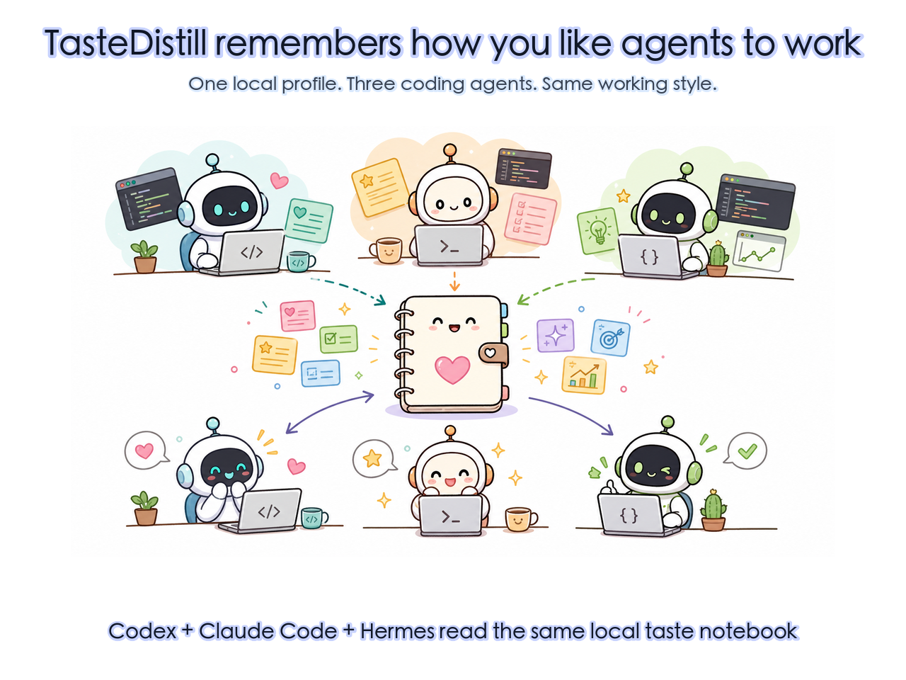
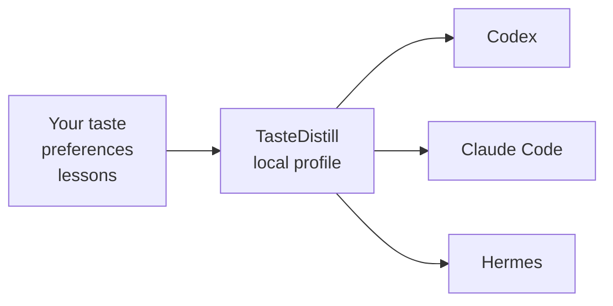
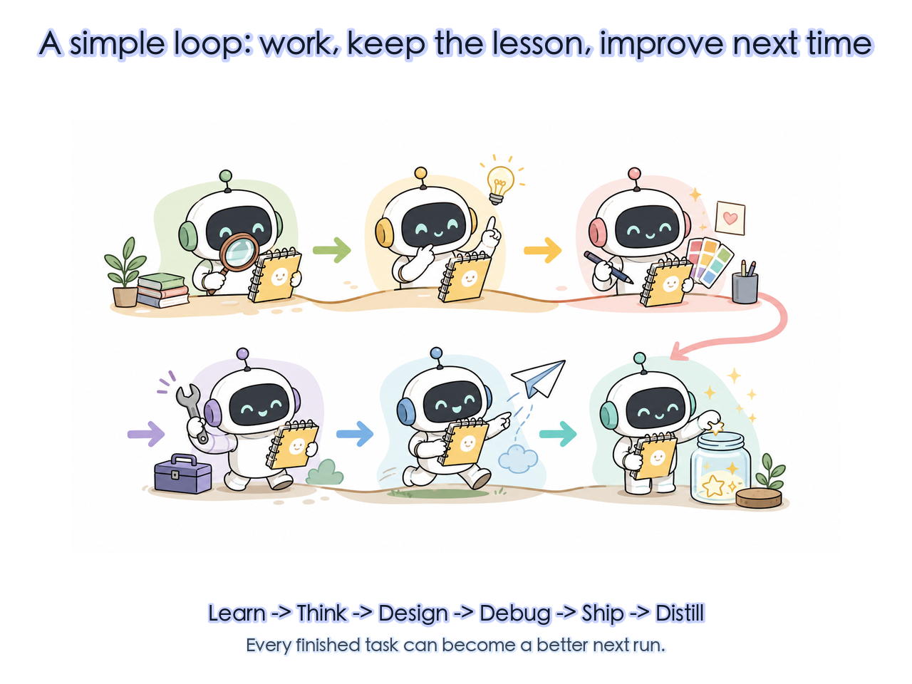
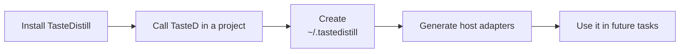
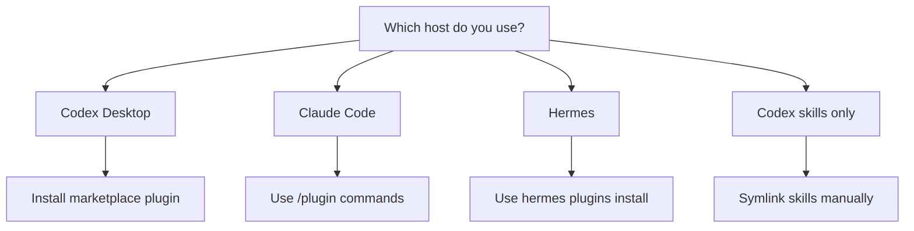

# TasteDistill

<p>
  <a href="./README.md"><strong>ENGLISH</strong></a>
  ·
  <a href="./README.zh-CN.md"><strong>中文</strong></a>
</p>

> Project About: TasteDistill lets Codex, Claude Code, and Hermes share local experience, preference memory, and engineering workflows.



TasteDistill is a small local notebook for your coding agents. It keeps your taste, habits, project lessons, and delivery rules in one place so Codex, Claude Code, and Hermes can work in a more consistent way.

| 🧠 What it stores | 🤖 Who can read it | 🔒 Where it lives |
|---|---|---|
| Your product taste, UI preferences, coding habits, and lessons | Codex, Claude Code, Hermes | On your machine, under `~/.tastedistill/` |



## 🧩 Why Use It

| Without TasteDistill | With TasteDistill |
|---|---|
| 😵 You repeat the same preferences in every new chat. | ✅ Your preferences live in one local profile. |
| 🧩 One agent learns something, but another agent does not know it. | 🔁 Codex, Claude Code, and Hermes can read the same working style. |
| 🗂️ Useful lessons stay buried in old conversations. | ✨ Finished work can turn into reusable lessons. |
| 🧱 Big global prompts become messy. | 🛠️ Each task follows a small, clear workflow. |

## 🎯 What It Helps With

TasteDistill is useful when you want an agent to remember things like:

- "I prefer simple, polished UI instead of decorative dashboard clutter."
- "Before changing code, first understand the current project structure."
- "After fixing a bug, show the exact verification result."
- "Do not overwrite host memory or project instruction files unless I ask."
- "Keep private user taste and project lessons outside public repositories."

The profile stays on your own machine by default:

```text
~/.tastedistill/
  profile.md      # your personal taste and working preferences
  harness.md      # how agents should verify, deliver, and distill lessons
  adapters/       # Codex, Claude Code, Hermes loading notes
  projects/       # project-specific lessons outside the business repo
```

## 🔁 How It Works



TasteDistill splits agent work into six easy stages:

| Stage | Use It When | What The Agent Should Do |
|---|---|---|
| Learn | The topic or repo is unfamiliar | Read sources, map facts, avoid guessing |
| Think | You need a plan or decision | Compare options, explain tradeoffs, choose a path |
| Design | UI, UX, product taste, or visual polish matters | Follow your taste, check real screens when needed |
| Debug | Something is broken | Reproduce, prove the root cause, fix the smallest thing |
| Ship | Work is almost done | Verify, check delivery details, prepare release or PR notes |
| Distill | A task taught something useful | Save the lesson for future runs |

## 🚀 First-Time Setup

After installing TasteDistill, use it normally in a project. The first explicit TasteD call also creates the local profile when needed.



Use the same everyday request you would normally ask an agent:

```text
Codex: @TasteD analyze this project
Claude Code: /tasted:think analyze this project
Hermes: tasted:think analyze this project
```

Just ask for the work you want done. On the first run, TasteD prepares your local profile automatically and then continues with that request.

TasteDistill will:

- look for existing local agent memory or instruction files
- when running in Codex, create a TasteDistill-owned source digest from Codex memory summary / registry when Codex has no existing `codex-experience-review.md`
- ask before reading broad personal history
- create `~/.tastedistill/profile.md`
- create `~/.tastedistill/harness.md`
- create `~/.tastedistill/imports/codex/source-digest.md` when needed
- generate adapter notes for Codex, Claude Code, and Hermes
- report what it created and what it skipped

It will not silently rewrite your host agent memory.

You do not need to create `~/.codex/instructions/codex-experience-review.md` first. If that file exists, TasteDistill treats it as a high-signal source. If it does not exist, TasteDistill distills Codex `memory_summary.md`, `MEMORY.md`, and targeted rollout summaries into its own local digest instead of writing back into Codex instruction files.

## 🧭 Choose An Install Path



##  Install In Codex Desktop

Use this if you want the easiest Codex experience with bundled skills and bundled CodeGraph MCP registration.

1. Open Codex Desktop.
2. Go to plugin marketplace management.
3. Add this repository as a marketplace:

```text
Source: sssstwee/tastedistill
Git ref: main
Sparse path: leave empty
```

4. Install `TasteD` (the plugin for the TasteDistill project).
5. Restart Codex.
6. In a project, call:

```text
@TasteD analyze this repo
```

You can also call the individual skills:

```text
tasted-learn
tasted-think
tasted-design
tasted-debug
tasted-ship
tasted-distill
```

##  Install In Claude Code

Claude Code uses plugin marketplace commands.

The Claude Code plugin also includes the bundled CodeGraph MCP config. Claude Code may ask you to trust or enable the MCP server before the `codegraph_*` tools appear.

Add the marketplace:

```text
/plugin marketplace add sssstwee/tastedistill
```

Install the plugin:

```text
/plugin install tasted@tastedistill
```

If your Claude Code version expects the plugin name directly, use:

```text
/plugin install tasted
```

Then use:

```text
/tasted:learn
/tasted:think
/tasted:design
/tasted:debug
/tasted:ship
/tasted:distill
```

TasteDistill does not automatically edit `CLAUDE.md`. It can generate a small adapter snippet, and you decide whether to add it.

##  Install In Hermes

Hermes installs plugins from a Git repository.

The Hermes plugin currently installs the TasteDistill workflow skills. It does not automatically register CodeGraph MCP. If your Hermes environment already exposes compatible `codegraph_*` tools, TasteDistill can still use them.

```bash
hermes plugins install sssstwee/tastedistill --enable
```

Restart Hermes after installing.

The skills are available under the TasteD namespace:

```text
tasted:learn
tasted:think
tasted:design
tasted:debug
tasted:ship
tasted:distill
```

If you installed without `--enable`, enable it later:

```bash
hermes plugins enable tasted
```

TasteDistill does not automatically edit `SOUL.md`, Hermes memories, config files, or `.env`.

## 🧰 Install Codex Skills Only

Use this only if you do not want the full Codex plugin and only want the skill files.

```bash
git clone https://github.com/sssstwee/tastedistill.git
cd tastedistill
mkdir -p "$HOME/.codex/skills"

for phase in learn think design debug ship distill; do
  rm -f "$HOME/.codex/skills/tasted-$phase"
  ln -s "$PWD/plugins/tastedistill/skills/tastedistill-$phase" "$HOME/.codex/skills/tasted-$phase"
done
```

Restart Codex and call the short skill names:

```text
tasted-learn
tasted-think
tasted-design
tasted-debug
tasted-ship
tasted-distill
```

## 🗺️ CodeGraph Support

TasteDistill can use [CodeGraph](https://github.com/colbymchenry/codegraph) to understand larger codebases faster.

In simple terms: CodeGraph is a local map of your repository. It helps the agent answer questions like:

- "Where is this feature implemented?"
- "What calls this function?"
- "What might break if we change this file?"

When you explicitly call TasteDistill inside a Git repository, it may initialize a local `.codegraph/` index for that repository and keep it out of Git.

| Host | Does the TasteDistill plugin include CodeGraph MCP registration? |
|---|---|
| Codex Desktop | ✅ Yes. The Codex plugin points to `plugins/tastedistill/.mcp.json`. |
| Claude Code | ✅ Yes. The Claude Code plugin also points to `plugins/tastedistill/.mcp.json`. |
| Hermes | ⚠️ Not yet. The Hermes plugin installs skills; use CodeGraph only if the host/session already exposes compatible `codegraph_*` tools. |

So "CodeGraph support" means two different things:

- **Codex / Claude Code**: the plugin ships the MCP registration and can start CodeGraph through `npx` when the host enables it.
- **Hermes**: the plugin does not currently wire MCP automatically; TasteDistill falls back to normal repository search unless CodeGraph tools are already available.

Manual setup is also possible:

```bash
cd your-project
npx -y @colbymchenry/codegraph init -i
```

## 🛡️ What TasteDistill Will Not Do By Default

TasteDistill is intentionally conservative.

It will not automatically:

- overwrite Codex `AGENTS.md`
- overwrite Claude `CLAUDE.md`
- overwrite Hermes `SOUL.md`
- copy raw private conversations into the repository
- read `.env` secrets
- publish or upload your personal profile

Your local profile is meant to stay local unless you choose otherwise.

## 🔄 Update

If you installed from Git:

```bash
cd /path/to/tastedistill
git pull
```

Then restart your host agent if it does not reload plugins automatically.

## 🙏 Acknowledgements

TasteDistill was inspired by useful ideas from:

- [Waza](https://github.com/tw93/Waza), especially the idea of small stage-based skills.
- [Andrej Karpathy](https://github.com/karpathy), for practical public notes about coding agents.
- [CodeGraph](https://github.com/colbymchenry/codegraph), for local code knowledge graph tooling.
