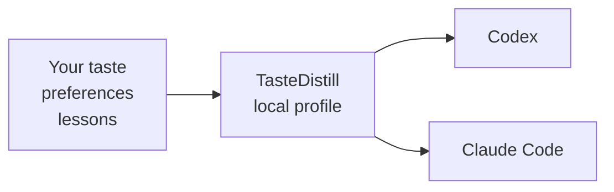
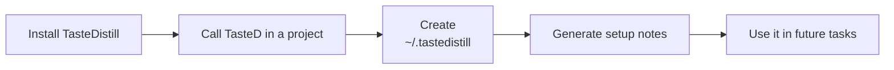
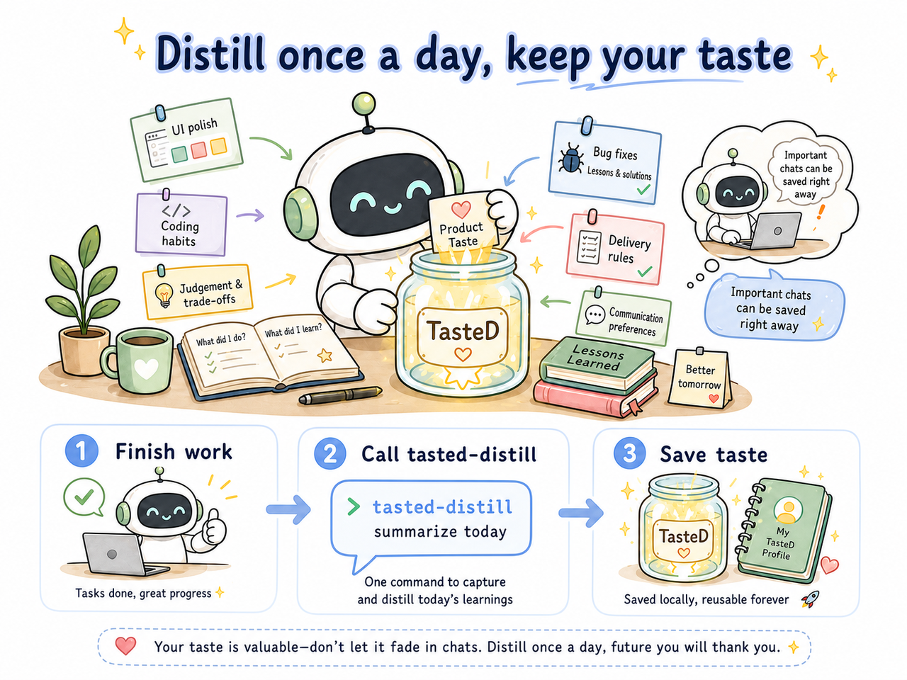
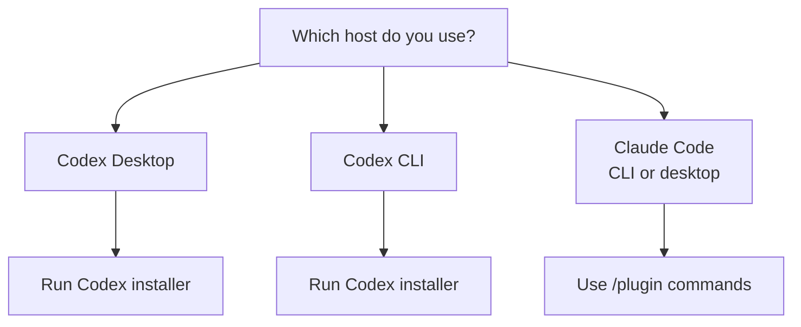

# TasteDistill

<p>
  <a href="./README.md"><strong>ENGLISH</strong></a>
  ·
  <a href="./README.zh-CN.md"><strong>中文</strong></a>
</p>

> Project About: TasteDistill lets Codex and Claude Code share local experience, preference memory, and engineering workflows.


TasteDistill is a small local notebook for your coding agents. It keeps your taste, habits, project lessons, and delivery rules in one place so Codex and Claude Code can work in a more consistent way.

| 🧠 What it stores | 🤖 Who can read it | 🔒 Where it lives |
|---|---|---|
| Your product taste, UI preferences, coding habits, and lessons | Codex, Claude Code | On your machine, under `~/.tastedistill/` |



## 🧩 Why Use It

| Without TasteDistill | With TasteDistill |
|---|---|
| 😵 You repeat the same preferences in every new chat. | ✅ Your preferences live in one local profile. |
| 🧩 One agent learns something, but another agent does not know it. | 🔁 Codex and Claude Code can read the same working style. |
| 🗂️ Useful lessons stay buried in old conversations. | ✨ Finished work can turn into reusable lessons. |
| 🧱 Big global prompts become messy. | 🛠️ Each task follows a small, clear workflow. |

## 🎯 What It Helps With

TasteDistill is useful when you want an agent to remember things like:

- "I prefer simple, polished UI instead of decorative dashboard clutter."
- "Before changing code, first understand the current project structure."
- "After fixing a bug, show the exact verification result."
- "Do not overwrite host memory or project instruction files unless I ask."
- "Keep private user taste and project lessons outside public repositories."

The profile stays on your own machine by default:

```text
~/.tastedistill/
  profile.md      # your personal taste and working preferences
  harness.md      # how agents should verify, deliver, and distill lessons
  adapters/       # Codex and Claude Code loading notes
  projects/       # project-specific lessons outside the business repo; Git is optional
```

## 🔁 How It Works


TasteDistill splits agent work into six easy stages:

| Stage | Use It When | What The Agent Should Do |
|---|---|---|
| Learn | The topic or repo is unfamiliar | Read sources, map facts, avoid guessing |
| Think | You need a plan or decision | Compare options, explain tradeoffs, choose a path |
| Design | UI, UX, product taste, or visual polish matters | Follow your taste, check real screens when needed |
| Debug | Something is broken | Reproduce, prove the root cause, fix the smallest thing |
| Ship | Work is almost done | Verify, check delivery details, prepare release or PR notes |
| Distill | A task taught something useful | Save the lesson for future runs |

## 🚀 First-Time Setup

After installing TasteDistill, use it normally in a project. The first explicit TasteD call also creates the local profile when needed.



Use the same everyday request you would normally ask an agent:

```text
Codex Desktop: @TasteD analyze this project
Codex CLI: @TasteD analyze this project
Claude Code: /tasted:think analyze this project
```

TasteD can be called in different ways depending on the host. Codex Desktop and Codex CLI can use the TasteD plugin, and Claude Code uses `/plugin` commands.

| Host | Everyday call | Stage call examples |
| --- | --- | --- |
| Codex Desktop | `@TasteD analyze this project` | `tasted-learn understand this project`<br>`tasted-think analyze this project`<br>`tasted-design improve this UI`<br>`tasted-debug debug this error`<br>`tasted-ship check if this is ready to release`<br>`tasted-distill summarize lessons from this work` |
| Codex CLI | `@TasteD analyze this project` | `tasted-learn understand this project`<br>`tasted-think analyze this project`<br>`tasted-design improve this UI`<br>`tasted-debug debug this error`<br>`tasted-ship check if this is ready to release`<br>`tasted-distill summarize lessons from this work` |
| Claude Code CLI or desktop | `/tasted:think analyze this project` | `/tasted:learn understand this project`<br>`/tasted:think analyze this project`<br>`/tasted:design improve this UI`<br>`/tasted:debug debug this error`<br>`/tasted:ship check if this is ready to release`<br>`/tasted:distill summarize lessons from this work` |

Just ask for the work you want done. On the first run, TasteD prepares your local profile automatically and then continues with that request.

TasteDistill will:

- look for existing local agent preferences and guidance
- when running in Codex, reuse your existing Codex preferences when available, or build a local TasteDistill summary from the safe records it can already see
- ask before reading broad personal history
- create `~/.tastedistill/profile.md`
- create `~/.tastedistill/harness.md`
- save a local summary of useful Codex context when needed
- generate setup notes for Codex and Claude Code
- report what it created and what it skipped

It will not silently rewrite your host agent memory.

You do not need to prepare any Codex preference file first. If Codex already has useful notes about how you like agents to work, TasteDistill will use them. If not, it will make its own local summary from the safe records it can already see. It will not quietly change Codex's own instructions or memories.

## ⚗️ Daily Habit: Distill Your Taste



In daily work, the most important TasteD habit is using `distill` after meaningful sessions. It saves the product taste, judgment, workflow preferences, and lessons that would otherwise disappear when the conversation ends.

Use it at least once when you finish work for the day:

```text
tasted-distill summarize today's lessons and save my taste
```

Use it immediately when a conversation contains something important that should be saved now:

```text
tasted-distill save the important preferences from this conversation
```

In Claude Code, use `/tasted:distill ...`.

## 🔄 Keep Agent Memory In Sync

TasteDistill treats host memory as a source, not as something to overwrite. When a host such as Codex has a main memory file plus newer correction notes, TasteD first builds an effective memory view, then imports stable rules into the portable store.

Use this when one agent has learned something that other agents should reuse:

```text
tasted-distill refresh and sync my host memory
```

The distill workflow runs the local helpers when available:

```text
scripts/refresh_host_memory.py  # write imports/<host>/effective-memory.*
scripts/sync_profile.py         # append stable rules to rules.jsonl
scripts/doctor.py               # report stale profile/imports/adapters
scripts/check_memory_freshness.py # compare mtimes and prompt before syncing
scripts/auto_setup.py           # refresh adapters and ~/.tastedistill/bin after plugin load, and ensure the current Git repo's CodeGraph index
scripts/install_adapters.py      # write TasteDistill adapter snippets
```

Use `--host codex` in Codex and `--host claude` in Claude Code.

This keeps newer host corrections from being hidden behind an older TasteDistill profile.

After updating to a new version, users do not need to run the adapter install script manually. When TasteD is loaded or any `tasted-*` skill is used, it runs an idempotent setup: refresh `~/.tastedistill/bin`, maintain the TasteDistill marker section in Codex/Claude host instruction files, and silently ensure the local `.codegraph/` index when the current directory is inside a Git repository. This setup only writes the TasteDistill-managed section, the current repository's `.codegraph/`, and `.gitignore`; it does not rewrite unrelated host instructions.

The automatic section tells the host to read only `profile.md`, `harness.md`, and `rules.jsonl` by default; raw host histories are still read only during explicit refresh/sync.

The installed adapter also uses `~/.tastedistill/bin/check_memory_freshness.py` as a lightweight preflight. It only compares the mtimes of Codex/Claude memory sources with `rules.jsonl`. If host memory is newer, it prompts with the specific stale object, for example:

```text
发现 Codex 的 memory 比 TasteD rules 更新，是否同步？
发现 Claude Code 的 memory 比 TasteD rules 更新，是否同步？
```

The agent should run refresh/sync commands only after the user confirms.

You can also import one host's memory from another host. For example, run this in Codex when you want Claude Code's latest project memory to become available through TasteDistill:

```bash
scripts/refresh_host_memory.py --host claude --project-root /path/to/project
scripts/sync_profile.py --host claude
scripts/doctor.py --host claude --project-root /path/to/project
```

Codex can then consume the shared rules from `~/.tastedistill/rules.jsonl` without reading Claude's raw memory files directly.

## 🧭 Choose An Install Path



##  Install In Codex Desktop

Use this if you want the easiest Codex experience with bundled skills and bundled CodeGraph MCP registration.

The recommended Codex installer uses Codex's implicit personal marketplace at `~/.agents/plugins/marketplace.json`. This is more stable than a Git marketplace entry in `~/.codex/config.toml`, because Codex Desktop may rewrite that config while it is already running.

```bash
git clone https://github.com/sssstwee/tastedistill.git ~/.local/share/tastedistill
python3 ~/.local/share/tastedistill/plugins/tastedistill/scripts/install_codex.py
```

If Codex Desktop was already open while installing, restart Codex Desktop or start a new thread before testing TasteD.

Open a project, then call:

```text
@TasteD analyze this repo
```

You can also call an individual skill directly:

```text
tasted-learn
tasted-think
tasted-design
tasted-debug
tasted-ship
tasted-distill
```

##  Install In Codex CLI

Use this if you run Codex from the terminal.

Use the same stable installer:

```bash
git clone https://github.com/sssstwee/tastedistill.git ~/.local/share/tastedistill
python3 ~/.local/share/tastedistill/plugins/tastedistill/scripts/install_codex.py
```

If you already cloned the repo, run the script from that checkout instead:

```bash
python3 plugins/tastedistill/scripts/install_codex.py
```

Start a new Codex session, then call:

```text
@TasteD analyze this repo
```

You can also call an individual skill directly:

```text
tasted-learn
tasted-think
tasted-design
tasted-debug
tasted-ship
tasted-distill
```

##  Install In Claude Code

Claude Code can be used from the terminal or from a desktop UI. Use the same plugin commands anywhere Claude Code exposes `/plugin`.

The Claude Code plugin also includes the bundled CodeGraph MCP config. Claude Code may ask you to trust or enable the MCP server before the `codegraph_*` tools appear.

Add the marketplace:

```text
/plugin marketplace add sssstwee/tastedistill
```

Install the plugin:

```text
/plugin install tasted@tastedistill
```

If your Claude Code version expects the plugin name directly, use:

```text
/plugin install tasted
```

Restart Claude Code or open a new Claude Code session, then call:

```text
/tasted:think analyze this project
```

You can also call any individual TasteD skill:

```text
/tasted:learn
/tasted:think
/tasted:design
/tasted:debug
/tasted:ship
/tasted:distill
```

TasteDistill may automatically maintain its own bounded marker section in `CLAUDE.md` after the plugin is loaded. It does not rewrite unrelated Claude instructions or sync raw memory without confirmation.

## 🔄 Update To The Latest Version

If you installed from `main`, update TasteD from the same host where you use it:

| Host | Update command |
| --- | --- |
| Codex Desktop | Restart Codex Desktop so the installed marketplace plugin refreshes from `main`. |
| Codex CLI | Run `codex plugin marketplace upgrade tastedistill`, then open a new Codex session. |
| Claude Code CLI or desktop | In Claude Code, type `/plugin update tasted` into the chat input and press Enter. Then restart Claude Code. |

Claude Code terminal equivalent:

```bash
claude plugin update tasted
```

## 🗺️ CodeGraph Support

TasteDistill can use [CodeGraph](https://github.com/colbymchenry/codegraph) to understand larger codebases faster.

In simple terms: CodeGraph is a local map of your repository. It helps the agent answer questions like:

- "Where is this feature implemented?"
- "What calls this function?"
- "What might break if we change this file?"

When you explicitly call TasteDistill inside a project directory, it may create a project profile under `~/.tastedistill/projects/`. Git is optional for this project-level memory. If the directory is also a Git repository, TasteDistill silently ensures a local `.codegraph/` index for that repository and keeps it out of Git.

| Host | Does the TasteDistill plugin include CodeGraph MCP registration? |
|---|---|
| Codex Desktop | ✅ Yes. The Codex plugin points to `plugins/tastedistill/.mcp.json`. |
| Codex CLI | ✅ Yes. The Codex CLI plugin install includes the same MCP registration. |
| Claude Code CLI or desktop | ✅ Yes. The Claude Code plugin also points to `plugins/tastedistill/.mcp.json`. |

So "CodeGraph support" means two different things:

**Codex Desktop / Codex CLI / Claude Code**: the plugin ships the MCP registration and can start CodeGraph through `npx` when the host enables it.

Each Git repository initializes its local index automatically on explicit TasteDistill use. You can also initialize it manually:

```bash
cd your-project
npx -y @colbymchenry/codegraph init -i
```

## 🛡️ What TasteDistill Will Not Do By Default

TasteDistill is intentionally conservative.

It will not automatically:

- overwrite Codex `AGENTS.md`
- overwrite Claude `CLAUDE.md`
- copy raw private conversations into the repository
- read `.env` secrets
- publish or upload your personal profile
- commit `.codegraph/` into Git

Your local profile is meant to stay local unless you choose otherwise.

## 🙏 Acknowledgements

TasteDistill was inspired by useful ideas from:

- [Waza](https://github.com/tw93/Waza), especially the idea of small stage-based skills.
- [Andrej Karpathy](https://github.com/karpathy), for practical public notes about coding agents.
- [CodeGraph](https://github.com/colbymchenry/codegraph), for local code knowledge graph tooling.
