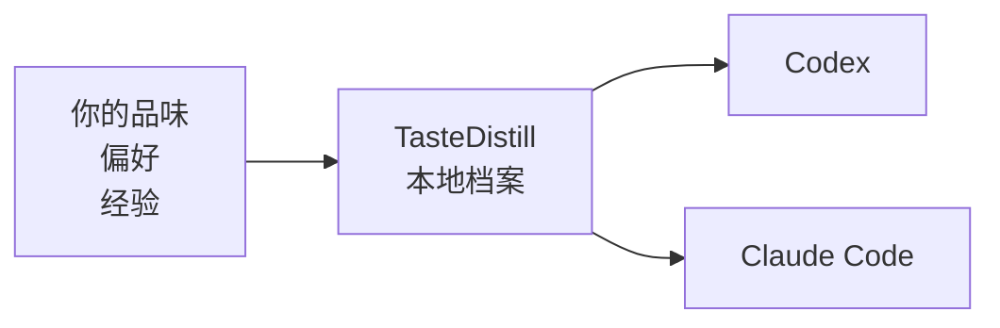
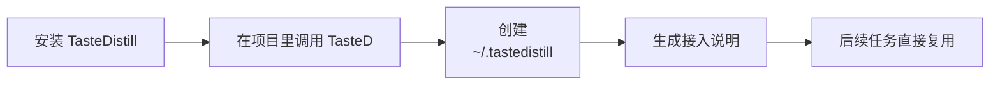
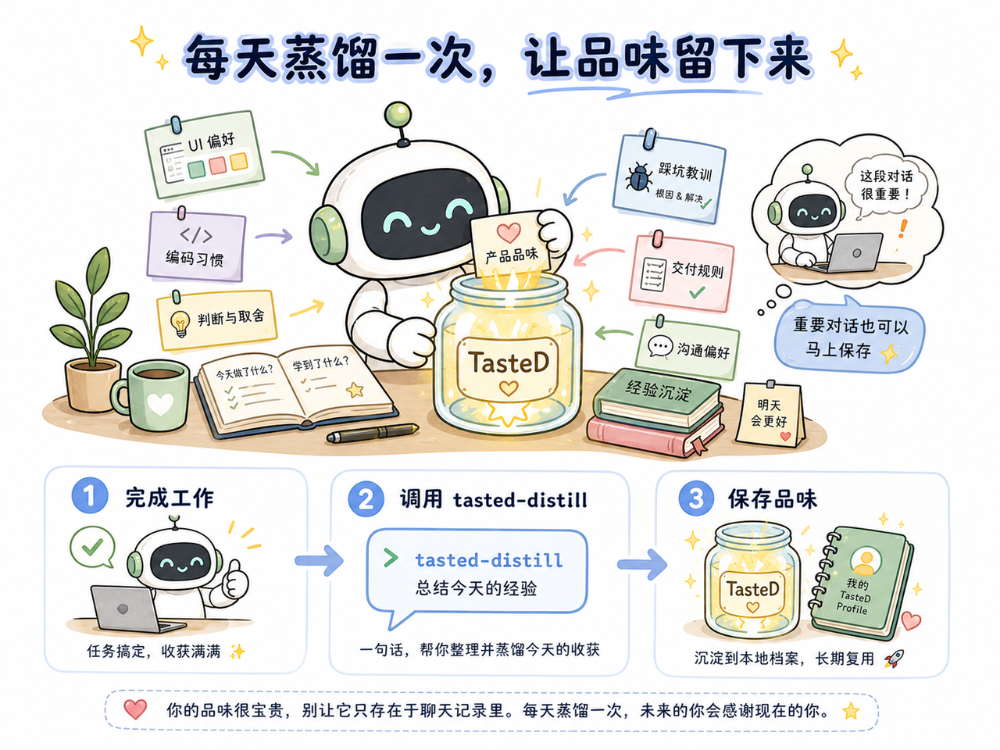
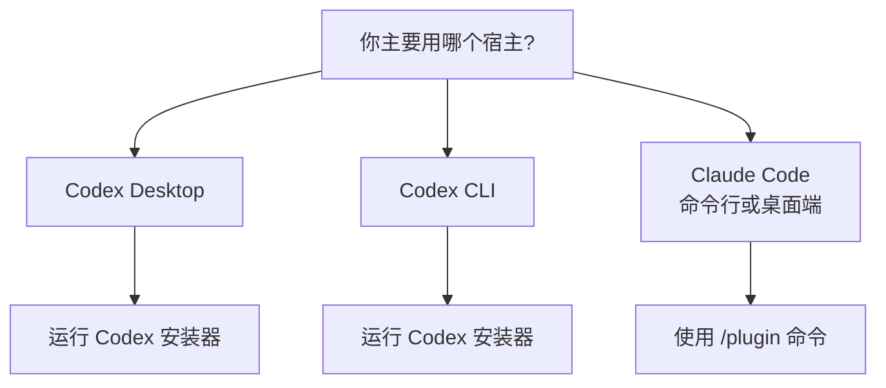

# TasteDistill 品味蒸馏

<p>
  <a href="./README.md"><strong>ENGLISH</strong></a>
  ·
  <a href="./README.zh-CN.md"><strong>中文</strong></a>
</p>

> 项目简介：让 Codex 和 Claude Code 共用本地经验、偏好记忆与工程工作流。


TasteDistill 可以理解成一个给 AI 用的“本地经验小本子”。它把你的审美、习惯、项目经验和交付规则放在同一个地方，让 Codex 和 Claude Code 更稳定地按你的方式做事。

| 🧠 它记什么 | 🤖 谁能读 | 🔒 存在哪里 |
|---|---|---|
| 产品审美、UI 偏好、编码习惯、踩坑经验 | Codex、Claude Code | 你的本机：`~/.tastedistill/` |



## 🧩 为什么需要它

| 没有 TasteDistill | 有了 TasteDistill |
|---|---|
| 😵 每开新对话，都要重新解释偏好。 | ✅ 偏好统一放在本地 profile 里。 |
| 🧩 一个 agent 学到的经验，另一个不知道。 | 🔁 Codex 和 Claude Code 可以读同一套工作方式。 |
| 🗂️ 有价值的教训埋在旧聊天记录里。 | ✨ 完成任务后，可以把经验沉淀下来。 |
| 🧱 全局提示词越写越长，很难维护。 | 🛠️ 做事流程拆成清楚的小步骤。 |

## 🎯 它能帮你记住什么

例如这些话，就很适合沉淀进 TasteDistill：

- “我喜欢简洁、细腻、真实可用的 UI，不喜欢装饰感太重的卡片堆叠。”
- “改代码前先理解当前项目结构，不要上来就乱搜乱改。”
- “修完 bug 后，要告诉我真实验证结果，而不是只说应该好了。”
- “不要默认覆盖宿主 agent 的 memory 或项目规范文件。”
- “个人偏好和私有项目经验留在本机，不要写进公开仓库。”

默认本地档案位置：

```text
~/.tastedistill/
  profile.md      # 你的个人偏好、审美、沟通方式、做事习惯
  harness.md      # agent 应该如何验证、交付、沉淀经验
  adapters/       # Codex 和 Claude Code 的接入说明
  projects/       # 项目级经验，放在业务仓库外面；不要求必须是 Git 仓库
```

## 🔁 工作方式


TasteDistill 把 agent 工作拆成 6 个很容易理解的阶段：

| 阶段 | 什么时候用 | AI 应该做什么 |
|---|---|---|
| 学习 | 项目、领域、资料不熟 | 先读资料，建立事实，不要瞎猜 |
| 思考 | 需要方案或判断 | 比较方案，说明取舍，给出路径 |
| 设计 | 涉及 UI、交互、产品审美 | 按你的品味做，并尽量看真实界面 |
| 调试 | 出错了、不符合预期 | 复现问题，证明根因，做最小修复 |
| 交付 | 快完成了 | 做验收、检查边界、准备发布或 PR |
| 沉淀 | 这次任务有经验可复用 | 把教训写进本地档案，后面继续用 |

## 🚀 第一次使用

安装后，直接在项目里正常使用即可。第一次显式调用 TasteD 时，会在需要时顺手完成本地 profile 初始化。



直接使用你平时会问 agent 的高频任务：

```text
Codex Desktop: @TasteD 分析这个项目
Codex CLI: @TasteD 分析这个项目
Claude Code: /tasted:think 分析这个项目
```

不同宿主的调用方式不完全一样。Codex Desktop 和 Codex CLI 都可以安装 TasteD plugin，Claude Code 使用 `/plugin` 命令。

| 宿主 | 日常入口 | 阶段调用示例 |
| --- | --- | --- |
| Codex Desktop | `@TasteD 分析这个项目` | `tasted-learn 了解这个项目`<br>`tasted-think 分析这个项目`<br>`tasted-design 优化这个界面`<br>`tasted-debug 排查这个报错`<br>`tasted-ship 检查是否可以发布`<br>`tasted-distill 总结这次经验` |
| Codex CLI | `@TasteD 分析这个项目` | `tasted-learn 了解这个项目`<br>`tasted-think 分析这个项目`<br>`tasted-design 优化这个界面`<br>`tasted-debug 排查这个报错`<br>`tasted-ship 检查是否可以发布`<br>`tasted-distill 总结这次经验` |
| Claude Code 命令行或桌面端 | `/tasted:think 分析这个项目` | `/tasted:learn 了解这个项目`<br>`/tasted:think 分析这个项目`<br>`/tasted:design 优化这个界面`<br>`/tasted:debug 排查这个报错`<br>`/tasted:ship 检查是否可以发布`<br>`/tasted:distill 总结这次经验` |

直接说你想做什么就可以。第一次使用时，TasteD 会自动准备本地档案，然后继续处理你的请求。

TasteDistill 会执行：

- 查找你本机已有的 agent 使用偏好和说明
- 在 Codex 中运行时，优先参考你已有的 Codex 使用偏好；如果没有现成整理，就从能安全读取的记录里整理一份 TasteDistill 自己的本地摘要
- 读取大范围个人历史前先问你
- 创建 `~/.tastedistill/profile.md`
- 创建 `~/.tastedistill/harness.md`
- 必要时保存一份 Codex 上下文的本地摘要
- 生成 Codex 和 Claude Code 的接入说明
- 告诉你读取了什么、跳过了什么、保存到了哪里

它不会偷偷改写宿主 agent 的 memory。

你不需要先准备任何 Codex 偏好文件。Codex 里如果已经有能体现你使用习惯的记录，TasteDistill 会优先参考；如果没有，它也会从当前能安全读取的记录里整理一份自己的本地摘要。它不会偷偷改 Codex 原本的 instructions 或 memories。

## ⚗️ 每日习惯：用 tasted-distill 保存品味



日常工作中，TasteDistill 最重要的使用习惯，是在有价值的对话或真实工作结束后使用 `distill`。它会把你的产品品味、判断方式、工作偏好和这次踩坑经验保存下来，避免这些宝贵经验随着对话结束而丢失。

建议每天工作结束后至少用一次：

```text
tasted-distill 总结今天的经验并保存我的品味
```

如果某段对话出现了重要偏好、关键判断或值得复用的经验，也可以当场立即保存：

```text
tasted-distill 保存这次对话里的重要偏好
```

在 Claude Code 里使用 `/tasted:distill ...`。

## 🔄 保持多 Agent 记忆同步

TasteDistill 把宿主记忆当作来源，而不是要覆盖的目标。当 Codex 这类宿主同时有主记忆和更新的纠偏 note 时，TasteD 会先建立 effective memory view，再把稳定规则导入跨 Agent 可读的本地 store。

当某个 agent 学到的规则也应该被其他 agent 复用时，可以这样使用：

```text
tasted-distill 刷新并同步我的宿主记忆
```

distill 工作流会优先调用本地 helper：

```text
scripts/refresh_host_memory.py  # 写入 imports/<host>/effective-memory.*
scripts/sync_profile.py         # 把稳定规则追加到 rules.jsonl
scripts/doctor.py               # 检查 profile/imports/adapters 是否过期
scripts/check_memory_freshness.py # 只比较时间戳，发现过期时提示是否同步
scripts/auto_setup.py           # 插件加载后自动刷新 adapter、~/.tastedistill/bin，并确保当前 Git repo 的 CodeGraph 索引
scripts/install_adapters.py      # 写入 TasteDistill adapter 片段
```

在 Codex 里使用 `--host codex`，在 Claude Code 里使用 `--host claude`。

这样新的宿主纠偏不会被旧的 TasteDistill profile 遮住。

更新到新版本后，用户不需要手动运行安装脚本。TasteD 被加载或任一 `tasted-*` skill 被使用时，会自动运行 idempotent setup：刷新 `~/.tastedistill/bin`，维护 Codex/Claude 宿主指令文件里的 TasteDistill marker section，并在当前目录属于 Git 仓库时静默确保本地 `.codegraph/` 索引存在。这个 setup 只写 TasteDistill 自己管理的片段、当前仓库的 `.codegraph/` 和 `.gitignore`，不会改写其他宿主指令。

自动写入的片段会让宿主默认只读取 `profile.md`、`harness.md` 和 `rules.jsonl`；原始宿主历史仍然只在明确 refresh/sync 时读取。

安装后的 adapter 还会使用 `~/.tastedistill/bin/check_memory_freshness.py` 做轻量预检。预检只比较 Codex/Claude 记忆来源和 `rules.jsonl` 的更新时间；如果发现宿主记忆更新，会按具体对象提示，例如：

```text
发现 Codex 的 memory 比 TasteD rules 更新，是否同步？
发现 Claude Code 的 memory 比 TasteD rules 更新，是否同步？
```

只有用户确认后，agent 才应该继续运行 refresh/sync 命令。

也可以在一个宿主里导入另一个宿主的记忆。例如在 Codex 里运行下面命令，让 Claude Code 的最新项目记忆通过 TasteDistill 变成 Codex 可读的共享规则：

```bash
scripts/refresh_host_memory.py --host claude --project-root /path/to/project
scripts/sync_profile.py --host claude
scripts/doctor.py --host claude --project-root /path/to/project
```

之后 Codex 读取 `~/.tastedistill/rules.jsonl` 即可复用这些共享规则，不需要直接读取 Claude 的原始记忆文件。

## 🧭 选择安装方式



##  安装到 Codex Desktop

如果你主要用 Codex，推荐用这个方式。它会同时安装 skills，并带上 CodeGraph MCP 注册配置。

推荐的 Codex 安装器会使用 Codex 隐式发现的个人 marketplace：`~/.agents/plugins/marketplace.json`。这比把 Git marketplace 写进 `~/.codex/config.toml` 更稳，因为 Codex Desktop 已经运行时可能会重写这个配置文件。

```bash
git clone https://github.com/sssstwee/tastedistill.git ~/.local/share/tastedistill
python3 ~/.local/share/tastedistill/plugins/tastedistill/scripts/install_codex.py
```

如果安装时 Codex Desktop 已经打开，安装后重启 Codex Desktop，或者至少新开一个线程再测试 TasteD。

打开一个项目后调用：

```text
@TasteD 分析这个项目
```

也可以单独调用某个 skill：

```text
tasted-learn
tasted-think
tasted-design
tasted-debug
tasted-ship
tasted-distill
```

##  安装到 Codex CLI

如果你在终端里使用 Codex，用这个方式安装。

使用同一个稳定安装器：

```bash
git clone https://github.com/sssstwee/tastedistill.git ~/.local/share/tastedistill
python3 ~/.local/share/tastedistill/plugins/tastedistill/scripts/install_codex.py
```

如果你已经 clone 了仓库，直接从当前 checkout 运行：

```bash
python3 plugins/tastedistill/scripts/install_codex.py
```

打开新的 Codex 会话后调用：

```text
@TasteD 分析这个项目
```

也可以单独调用某个 skill：

```text
tasted-learn
tasted-think
tasted-design
tasted-debug
tasted-ship
tasted-distill
```

##  安装到 Claude Code

Claude Code 有命令行和桌面端入口。只要当前入口支持输入 `/plugin`，就使用同一套插件命令。

Claude Code 插件里也包含同一份 CodeGraph MCP 配置。Claude Code 可能会要求你信任或启用 MCP server，之后才会出现 `codegraph_*` tools。

添加 marketplace：

```text
/plugin marketplace add sssstwee/tastedistill
```

安装 plugin：

```text
/plugin install tasted@tastedistill
```

如果你的 Claude Code 版本要求直接写插件名，可以用：

```text
/plugin install tasted
```

重启 Claude Code，或者打开一个新的 Claude Code 会话后调用：

```text
/tasted:think 分析这个项目
```

也可以单独调用某个 TasteD skill：

```text
/tasted:learn
/tasted:think
/tasted:design
/tasted:debug
/tasted:ship
/tasted:distill
```

TasteDistill 被加载后可以自动维护 `CLAUDE.md` 里属于自己的 bounded marker section。它不会改写无关 Claude 指令，也不会在未确认时同步原始记忆。

## 🔄 更新到最新版

如果你是从 `main` 安装的 TasteD，就在对应宿主里更新：

| 宿主 | 更新方式 |
| --- | --- |
| Codex Desktop | 重启 Codex Desktop，让已安装的 marketplace plugin 从 `main` 刷新。 |
| Codex CLI | 执行 `codex plugin marketplace upgrade tastedistill`，然后打开新的 Codex 会话。 |
| Claude Code 命令行或桌面端 | 在 Claude Code 的聊天输入框里输入 `/plugin update tasted` 并回车，然后重启 Claude Code。 |

Claude Code 也可以在终端里执行：

```bash
claude plugin update tasted
```

## 🗺️ CodeGraph 是什么

TasteDistill 可以配合 [CodeGraph](https://github.com/colbymchenry/codegraph) 理解大型代码仓库。

大白话解释：CodeGraph 就像给代码仓库做一张本地图谱。它能帮 agent 更快回答：

- “这个功能在哪里实现？”
- “谁调用了这个函数？”
- “改这个文件可能影响哪里？”

当你在 Git 仓库里明确调用 TasteDistill 时，它会为当前仓库静默确保本地 `.codegraph/` 索引存在，并且避免把它提交进 Git。

| 宿主 | TasteDistill plugin 是否内置 CodeGraph MCP 注册 |
|---|---|
| Codex Desktop | ✅ 是。Codex plugin 指向 `plugins/tastedistill/.mcp.json`。 |
| Codex CLI | ✅ 是。Codex CLI plugin 安装会带上同一份 MCP 注册配置。 |
| Claude Code 命令行或桌面端 | ✅ 是。Claude Code plugin 也指向 `plugins/tastedistill/.mcp.json`。 |

所以 “CodeGraph 支持” 分两种情况：

**Codex Desktop / Codex CLI / Claude Code**：plugin 自带 MCP 注册配置，可以在宿主启用后通过 `npx` 启动 CodeGraph。

显式调用 TasteDistill 时，即使当前目录不是 Git 仓库，也可以在 `~/.tastedistill/projects/` 下生成项目级 profile。Git 不是项目级记忆的前提，只是 CodeGraph 的前提。

每个 Git 仓库第一次显式使用 TasteDistill 时会自动初始化一次本地索引；也可以手动运行：

```bash
cd your-project
npx -y @colbymchenry/codegraph init -i
```

## 🛡️ 默认不会做什么

TasteDistill 默认比较克制。

它不会自动：

- 覆盖 Codex `AGENTS.md`
- 覆盖 Claude `CLAUDE.md`
- 把原始私人对话复制进仓库
- 读取 `.env` 密钥
- 上传或公开你的个人 profile
- 把 `.codegraph/` 写入 Git 提交

你的个人档案默认留在本机。

## 🙏 致谢

TasteDistill 的设计受到了这些项目和公开经验的启发：

- [Waza](https://github.com/tw93/Waza)：阶段化 skills 的设计思路。
- [Andrej Karpathy](https://github.com/karpathy)：关于 coding agent 实用工作方式的公开分享。
- [CodeGraph](https://github.com/colbymchenry/codegraph)：本地代码知识图谱工具。
