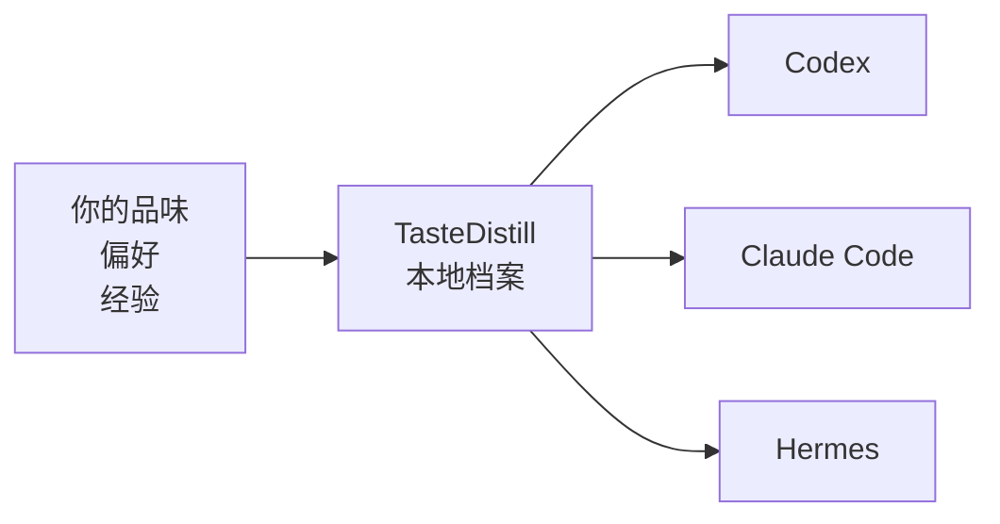
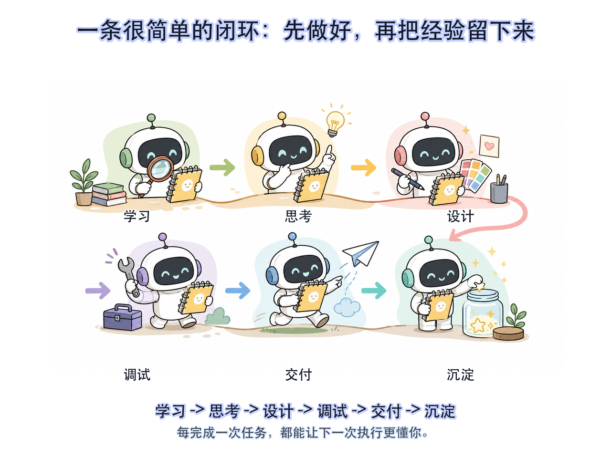
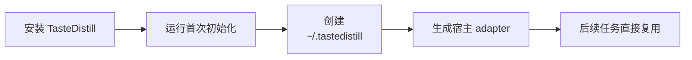
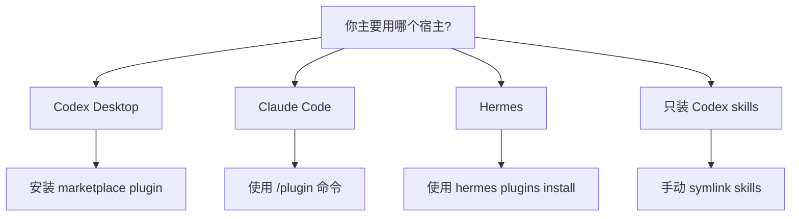

# TasteDistill

<p>
  <a href="./README.md"></a>
  <a href="./README.zh-CN.md"></a>
</p>


TasteDistill 可以理解成一个给 AI 用的“本地经验小本子”。它把你的审美、习惯、项目经验和交付规则放在同一个地方，让 Codex、Claude Code、Hermes 都能更稳定地按你的方式做事。

| 🧠 它记什么 | 🤖 谁能读 | 🔒 存在哪里 |
|---|---|---|
| 产品审美、UI 偏好、编码习惯、踩坑经验 | Codex、Claude Code、Hermes | 你的本机：`~/.tastedistill/` |



## 🧩 为什么需要它

| 没有 TasteDistill | 有了 TasteDistill |
|---|---|
| 😵 每开新对话，都要重新解释偏好。 | ✅ 偏好统一放在本地 profile 里。 |
| 🧩 一个 agent 学到的经验，另一个不知道。 | 🔁 三个 agent 可以读同一套工作方式。 |
| 🗂️ 有价值的教训埋在旧聊天记录里。 | ✨ 完成任务后，可以把经验沉淀下来。 |
| 🧱 全局提示词越写越长，很难维护。 | 🛠️ 做事流程拆成清楚的小步骤。 |

## 🎯 它能帮你记住什么

例如这些话，就很适合沉淀进 TasteDistill：

- “我喜欢简洁、细腻、真实可用的 UI，不喜欢装饰感太重的卡片堆叠。”
- “改代码前先理解当前项目结构，不要上来就乱搜乱改。”
- “修完 bug 后，要告诉我真实验证结果，而不是只说应该好了。”
- “不要默认覆盖宿主 agent 的 memory 或项目规范文件。”
- “个人偏好和私有项目经验留在本机，不要写进公开仓库。”

默认本地档案位置：

```text
~/.tastedistill/
  profile.md      # 你的个人偏好、审美、沟通方式、做事习惯
  harness.md      # agent 应该如何验证、交付、沉淀经验
  adapters/       # Codex、Claude Code、Hermes 的接入说明
  projects/       # 项目级经验，放在业务仓库外面
```

## 🔁 工作方式



TasteDistill 把 agent 工作拆成 6 个很容易理解的阶段：

| 阶段 | 什么时候用 | AI 应该做什么 |
|---|---|---|
| 学习 | 项目、领域、资料不熟 | 先读资料，建立事实，不要瞎猜 |
| 思考 | 需要方案或判断 | 比较方案，说明取舍，给出路径 |
| 设计 | 涉及 UI、交互、产品审美 | 按你的品味做，并尽量看真实界面 |
| 调试 | 出错了、不符合预期 | 复现问题，证明根因，做最小修复 |
| 交付 | 快完成了 | 做验收、检查边界、准备发布或 PR |
| 沉淀 | 这次任务有经验可复用 | 把教训写进本地档案，后面继续用 |

## 🚀 第一次使用

安装后，建议先做一次初始化。



在 Codex 里可以直接说：

```text
@TasteDistill 初始化我的本地 profile
```

也可以用 distill skill：

```text
使用 tastedistill-distill 初始化我的本地 TasteDistill profile。
```

第一次初始化时，TasteDistill 应该：

- 查找你本机已有的 agent memory 或 instruction 文件
- 读取大范围个人历史前先问你
- 创建 `~/.tastedistill/profile.md`
- 创建 `~/.tastedistill/harness.md`
- 生成 Codex、Claude Code、Hermes 的 adapter 说明
- 告诉你读取了什么、跳过了什么、保存到了哪里

它不应该偷偷改写宿主 agent 的 memory。

## 🧭 选择安装方式



## 🧱 安装到 Codex Desktop

如果你主要用 Codex，推荐用这个方式。它会同时安装 skills 和 CodeGraph 支持。

1. 打开 Codex Desktop。
2. 进入插件市场管理。
3. 添加这个仓库作为插件市场：

```text
来源：sssstwee/tastedistill
Git 引用：main
稀疏路径：留空
```

4. 安装 `TasteDistill`。
5. 重启 Codex。
6. 在任意项目里调用：

```text
@TasteDistill 分析这个项目
```

也可以单独调用这些 skills：

```text
tastedistill-learn
tastedistill-think
tastedistill-design
tastedistill-debug
tastedistill-ship
tastedistill-distill
```

## 🟣 安装到 Claude Code

Claude Code 使用插件市场命令安装。

添加 marketplace：

```text
/plugin marketplace add sssstwee/tastedistill
```

安装 plugin：

```text
/plugin install tastedistill@tastedistill
```

如果你的 Claude Code 版本要求直接写插件名，可以用：

```text
/plugin install tastedistill
```

然后调用：

```text
/tastedistill:learn
/tastedistill:think
/tastedistill:design
/tastedistill:debug
/tastedistill:ship
/tastedistill:distill
```

TasteDistill 默认不会自动修改 `CLAUDE.md`。它可以生成一段接入说明，由你决定要不要写进去。

## 🪽 安装到 Hermes

Hermes 可以直接从 Git 仓库安装插件。

```bash
hermes plugins install sssstwee/tastedistill --enable
```

安装后重启 Hermes。

skills 会以 TasteDistill 命名空间暴露：

```text
tastedistill:learn
tastedistill:think
tastedistill:design
tastedistill:debug
tastedistill:ship
tastedistill:distill
```

如果安装时没有加 `--enable`，之后可以手动启用：

```bash
hermes plugins enable tastedistill
```

TasteDistill 默认不会改 `SOUL.md`、Hermes memories、配置文件或 `.env`。

## 🧰 只安装 Codex Skills

如果你不想安装完整 Codex plugin，只想安装 skill 文件，可以这样做：

```bash
git clone https://github.com/sssstwee/tastedistill.git
cd tastedistill
mkdir -p "$HOME/.codex/skills"

for skill in tastedistill-learn tastedistill-think tastedistill-design tastedistill-debug tastedistill-ship tastedistill-distill; do
  rm -f "$HOME/.codex/skills/$skill"
  ln -s "$PWD/plugins/tastedistill/skills/$skill" "$HOME/.codex/skills/$skill"
done
```

重启 Codex 后输入：

```text
/tastedistill
```

## 🗺️ CodeGraph 是什么

TasteDistill 可以配合 [CodeGraph](https://github.com/colbymchenry/codegraph) 理解大型代码仓库。

大白话解释：CodeGraph 就像给代码仓库做一张本地图谱。它能帮 agent 更快回答：

- “这个功能在哪里实现？”
- “谁调用了这个函数？”
- “改这个文件可能影响哪里？”

当你在 Git 仓库里明确调用 TasteDistill 时，它可以为当前仓库初始化本地 `.codegraph/` 索引，并且避免把它提交进 Git。

也可以手动初始化：

```bash
cd your-project
npx -y @colbymchenry/codegraph init -i
```

## 🛡️ 默认不会做什么

TasteDistill 默认比较克制。

它不会自动：

- 覆盖 Codex `AGENTS.md`
- 覆盖 Claude `CLAUDE.md`
- 覆盖 Hermes `SOUL.md`
- 把原始私人对话复制进仓库
- 读取 `.env` 密钥
- 上传或公开你的个人 profile

你的个人档案默认留在本机。

## 🔄 更新

如果你是从 Git 安装的：

```bash
cd /path/to/tastedistill
git pull
```

如果宿主 agent 没有自动刷新插件，重启一次即可。

## 🙏 致谢

TasteDistill 的设计受到了这些项目和公开经验的启发：

- [Waza](https://github.com/tw93/Waza)：阶段化 skills 的设计思路。
- [Andrej Karpathy](https://github.com/karpathy)：关于 coding agent 实用工作方式的公开分享。
- [CodeGraph](https://github.com/colbymchenry/codegraph)：本地代码知识图谱工具。
