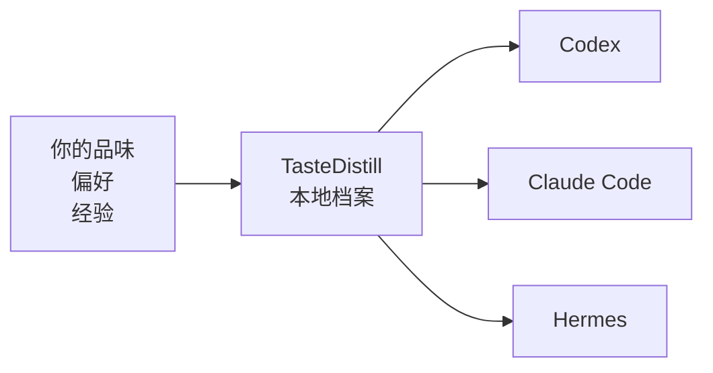
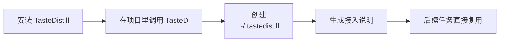
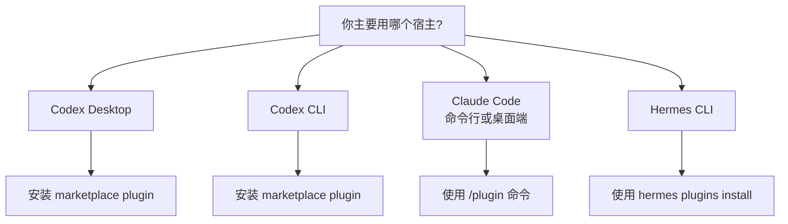

# TasteDistill 品味蒸馏

<p>
  <a href="./README.md"><strong>ENGLISH</strong></a>
  ·
  <a href="./README.zh-CN.md"><strong>中文</strong></a>
</p>

> 项目简介：让 Codex、Claude Code、Hermes 共用本地经验、偏好记忆与工程工作流。


TasteDistill 可以理解成一个给 AI 用的“本地经验小本子”。它把你的审美、习惯、项目经验和交付规则放在同一个地方，让 Codex、Claude Code、Hermes 都能更稳定地按你的方式做事。

| 🧠 它记什么 | 🤖 谁能读 | 🔒 存在哪里 |
|---|---|---|
| 产品审美、UI 偏好、编码习惯、踩坑经验 | Codex、Claude Code、Hermes | 你的本机：`~/.tastedistill/` |



## 🧩 为什么需要它

| 没有 TasteDistill | 有了 TasteDistill |
|---|---|
| 😵 每开新对话，都要重新解释偏好。 | ✅ 偏好统一放在本地 profile 里。 |
| 🧩 一个 agent 学到的经验，另一个不知道。 | 🔁 三个 agent 可以读同一套工作方式。 |
| 🗂️ 有价值的教训埋在旧聊天记录里。 | ✨ 完成任务后，可以把经验沉淀下来。 |
| 🧱 全局提示词越写越长，很难维护。 | 🛠️ 做事流程拆成清楚的小步骤。 |

## 🎯 它能帮你记住什么

例如这些话，就很适合沉淀进 TasteDistill：

- “我喜欢简洁、细腻、真实可用的 UI，不喜欢装饰感太重的卡片堆叠。”
- “改代码前先理解当前项目结构，不要上来就乱搜乱改。”
- “修完 bug 后，要告诉我真实验证结果，而不是只说应该好了。”
- “不要默认覆盖宿主 agent 的 memory 或项目规范文件。”
- “个人偏好和私有项目经验留在本机，不要写进公开仓库。”

默认本地档案位置：

```text
~/.tastedistill/
  profile.md      # 你的个人偏好、审美、沟通方式、做事习惯
  harness.md      # agent 应该如何验证、交付、沉淀经验
  adapters/       # Codex、Claude Code、Hermes 的接入说明
  projects/       # 项目级经验，放在业务仓库外面
```

## 🔁 工作方式


TasteDistill 把 agent 工作拆成 6 个很容易理解的阶段：

| 阶段 | 什么时候用 | AI 应该做什么 |
|---|---|---|
| 学习 | 项目、领域、资料不熟 | 先读资料，建立事实，不要瞎猜 |
| 思考 | 需要方案或判断 | 比较方案，说明取舍，给出路径 |
| 设计 | 涉及 UI、交互、产品审美 | 按你的品味做，并尽量看真实界面 |
| 调试 | 出错了、不符合预期 | 复现问题，证明根因，做最小修复 |
| 交付 | 快完成了 | 做验收、检查边界、准备发布或 PR |
| 沉淀 | 这次任务有经验可复用 | 把教训写进本地档案，后面继续用 |

## 🚀 第一次使用

安装后，直接在项目里正常使用即可。第一次显式调用 TasteD 时，会在需要时顺手完成本地 profile 初始化。



直接使用你平时会问 agent 的高频任务：

```text
Codex Desktop: @TasteD 分析这个项目
Codex CLI: @TasteD 分析这个项目
Claude Code: /tasted:think 分析这个项目
Hermes CLI: tasted:think 分析这个项目
```

不同宿主的调用方式不完全一样，但都可以进入对应阶段的 TasteD skill。Codex Desktop 和 Codex CLI 都可以安装 TasteD plugin，Claude Code 使用 `/plugin` 命令，Hermes 是命令行形式。

| 宿主 | 日常入口 | 阶段 skill 调用 |
| --- | --- | --- |
| Codex Desktop | `@TasteD 分析这个项目` | `tasted-learn`、`tasted-think`、`tasted-design`、`tasted-debug`、`tasted-ship`、`tasted-distill` |
| Codex CLI | `@TasteD 分析这个项目` | `tasted-learn`、`tasted-think`、`tasted-design`、`tasted-debug`、`tasted-ship`、`tasted-distill` |
| Claude Code 命令行或桌面端 | `/tasted:think 分析这个项目` | `/tasted:learn`、`/tasted:think`、`/tasted:design`、`/tasted:debug`、`/tasted:ship`、`/tasted:distill` |
| Hermes CLI | `tasted:think 分析这个项目` | `tasted:learn`、`tasted:think`、`tasted:design`、`tasted:debug`、`tasted:ship`、`tasted:distill` |

直接说你想做什么就可以。第一次使用时，TasteD 会自动准备本地档案，然后继续处理你的请求。

TasteDistill 会执行：

- 查找你本机已有的 agent 使用偏好和说明
- 在 Codex 中运行时，优先参考你已有的 Codex 使用偏好；如果没有现成整理，就从能安全读取的记录里整理一份 TasteDistill 自己的本地摘要
- 读取大范围个人历史前先问你
- 创建 `~/.tastedistill/profile.md`
- 创建 `~/.tastedistill/harness.md`
- 必要时保存一份 Codex 上下文的本地摘要
- 生成 Codex、Claude Code、Hermes 的接入说明
- 告诉你读取了什么、跳过了什么、保存到了哪里

它不会偷偷改写宿主 agent 的 memory。

你不需要先准备任何 Codex 偏好文件。Codex 里如果已经有能体现你使用习惯的记录，TasteDistill 会优先参考；如果没有，它也会从当前能安全读取的记录里整理一份自己的本地摘要。它不会偷偷改 Codex 原本的 instructions 或 memories。

## 🧭 选择安装方式



##  安装到 Codex Desktop

如果你主要用 Codex，推荐用这个方式。它会同时安装 skills，并带上 CodeGraph MCP 注册配置。

1. 打开 Codex Desktop。
2. 进入插件市场管理。
3. 添加这个仓库作为插件市场：

```text
来源：sssstwee/tastedistill
Git 引用：main
稀疏路径：留空
```

4. 安装 `TasteD`（TasteDistill 项目的插件短名）。
5. 重启 Codex。
6. 打开一个项目后调用：

```text
@TasteD 分析这个项目
```

也可以单独调用某个 skill：

```text
tasted-learn
tasted-think
tasted-design
tasted-debug
tasted-ship
tasted-distill
```

##  安装到 Codex CLI

如果你在终端里使用 Codex，用这个方式安装。

添加 marketplace：

```bash
codex plugin marketplace add sssstwee/tastedistill --ref main
```

安装 plugin：

```bash
codex plugin add tasted@tastedistill
```

打开新的 Codex 会话后调用：

```text
@TasteD 分析这个项目
```

也可以单独调用某个 skill：

```text
tasted-learn
tasted-think
tasted-design
tasted-debug
tasted-ship
tasted-distill
```

##  安装到 Claude Code

Claude Code 有命令行和桌面端入口。只要当前入口支持输入 `/plugin`，就使用同一套插件命令。

Claude Code 插件里也包含同一份 CodeGraph MCP 配置。Claude Code 可能会要求你信任或启用 MCP server，之后才会出现 `codegraph_*` tools。

添加 marketplace：

```text
/plugin marketplace add sssstwee/tastedistill
```

安装 plugin：

```text
/plugin install tasted@tastedistill
```

如果你的 Claude Code 版本要求直接写插件名，可以用：

```text
/plugin install tasted
```

重启 Claude Code，或者打开一个新的 Claude Code 会话后调用：

```text
/tasted:think 分析这个项目
```

也可以单独调用某个 TasteD skill：

```text
/tasted:learn
/tasted:think
/tasted:design
/tasted:debug
/tasted:ship
/tasted:distill
```

TasteDistill 默认不会自动修改 `CLAUDE.md`。它可以生成一段接入说明，由你决定要不要写进去。

##  安装到 Hermes CLI

Hermes 是命令行形式，通过 Git 仓库安装插件。

Hermes 插件目前安装的是 TasteDistill workflow skills，不会自动注册 CodeGraph MCP。如果你的 Hermes 环境已经暴露了兼容的 `codegraph_*` tools，TasteDistill 仍然可以使用它们。

```bash
hermes plugins install sssstwee/tastedistill --enable
```

安装后重启 Hermes。

打开新的 Hermes 会话后调用：

```text
tasted:think 分析这个项目
```

也可以通过插件命名空间调用某个 TasteD skill：

```text
tasted:learn
tasted:think
tasted:design
tasted:debug
tasted:ship
tasted:distill
```

如果安装时没有加 `--enable`，之后可以手动启用：

```bash
hermes plugins enable tasted
```

TasteDistill 默认不会改 `SOUL.md`、Hermes memories、配置文件或 `.env`。

## 🧰 只手动安装 Codex Skills

只有在旧版 Codex CLI 没有 `codex plugin` 命令，或者你明确不想安装完整 plugin、只想安装 skill 文件时，才使用这个备用方式：

```bash
git clone https://github.com/sssstwee/tastedistill.git
cd tastedistill
mkdir -p "$HOME/.codex/skills"

for phase in learn think design debug ship distill; do
  rm -f "$HOME/.codex/skills/tasted-$phase"
  ln -s "$PWD/plugins/tastedistill/skills/tastedistill-$phase" "$HOME/.codex/skills/tasted-$phase"
done
```

重启 Codex 后调用短 skill 名：

```text
tasted-learn
tasted-think
tasted-design
tasted-debug
tasted-ship
tasted-distill
```

## 🔄 更新到最新版

如果你是从 `main` 安装的 TasteD，就在对应宿主里更新：

| 宿主 | 更新方式 |
| --- | --- |
| Codex Desktop | 重启 Codex Desktop，让已安装的 marketplace plugin 从 `main` 刷新。 |
| Codex CLI | 执行 `codex plugin marketplace upgrade tastedistill`，然后打开新的 Codex 会话。 |
| Claude Code 命令行或桌面端 | 在 Claude Code 的聊天输入框里输入 `/plugin update tasted` 并回车，然后重启 Claude Code。 |
| Hermes CLI | 执行 `hermes plugins update tasted`，然后打开新的 Hermes 会话。 |

Claude Code 也可以在终端里执行：

```bash
claude plugin update tasted
```

Hermes 在终端里执行：

```bash
hermes plugins update tasted
```

## 🗺️ CodeGraph 是什么

TasteDistill 可以配合 [CodeGraph](https://github.com/colbymchenry/codegraph) 理解大型代码仓库。

大白话解释：CodeGraph 就像给代码仓库做一张本地图谱。它能帮 agent 更快回答：

- “这个功能在哪里实现？”
- “谁调用了这个函数？”
- “改这个文件可能影响哪里？”

当你在 Git 仓库里明确调用 TasteDistill 时，它可以为当前仓库初始化本地 `.codegraph/` 索引，并且避免把它提交进 Git。

| 宿主 | TasteDistill plugin 是否内置 CodeGraph MCP 注册 |
|---|---|
| Codex Desktop | ✅ 是。Codex plugin 指向 `plugins/tastedistill/.mcp.json`。 |
| Codex CLI | ✅ 是。用 `codex plugin add` 安装时会带上 MCP 注册；只有手动安装 skills 的备用方式不会自动注册 MCP。 |
| Claude Code 命令行或桌面端 | ✅ 是。Claude Code plugin 也指向 `plugins/tastedistill/.mcp.json`。 |
| Hermes CLI | ⚠️ 不会自动接入。想在 Hermes 里使用 `codegraph_*` tools，需要手动把 CodeGraph 加到 Hermes MCP。 |

所以 “CodeGraph 支持” 分两种情况：

- **Codex Desktop / Codex CLI / Claude Code**：plugin 自带 MCP 注册配置，可以在宿主启用后通过 `npx` 启动 CodeGraph。
- **Hermes CLI**：需要你手动把 CodeGraph 加到 Hermes MCP；不配置也可以用 TasteDistill，只是会回退到普通文件搜索和定向读取。

Hermes 手动接入 CodeGraph：

```yaml
# ~/.hermes/config.yaml
mcp_servers:
  codegraph:
    command: "npx"
    args: ["-y", "@colbymchenry/codegraph", "serve", "--mcp"]
```

然后测试连接，并打开新的 Hermes 会话：

```bash
hermes mcp test codegraph
```

每个需要 CodeGraph 的项目，第一次使用前初始化一次本地索引：

```bash
cd your-project
npx -y @colbymchenry/codegraph init -i
```

## 🛡️ 默认不会做什么

TasteDistill 默认比较克制。

它不会自动：

- 覆盖 Codex `AGENTS.md`
- 覆盖 Claude `CLAUDE.md`
- 覆盖 Hermes `SOUL.md`
- 把原始私人对话复制进仓库
- 读取 `.env` 密钥
- 上传或公开你的个人 profile

你的个人档案默认留在本机。

## 🙏 致谢

TasteDistill 的设计受到了这些项目和公开经验的启发：

- [Waza](https://github.com/tw93/Waza)：阶段化 skills 的设计思路。
- [Andrej Karpathy](https://github.com/karpathy)：关于 coding agent 实用工作方式的公开分享。
- [CodeGraph](https://github.com/colbymchenry/codegraph)：本地代码知识图谱工具。
